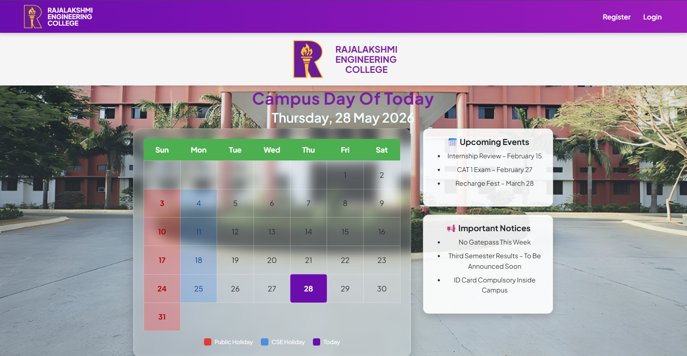
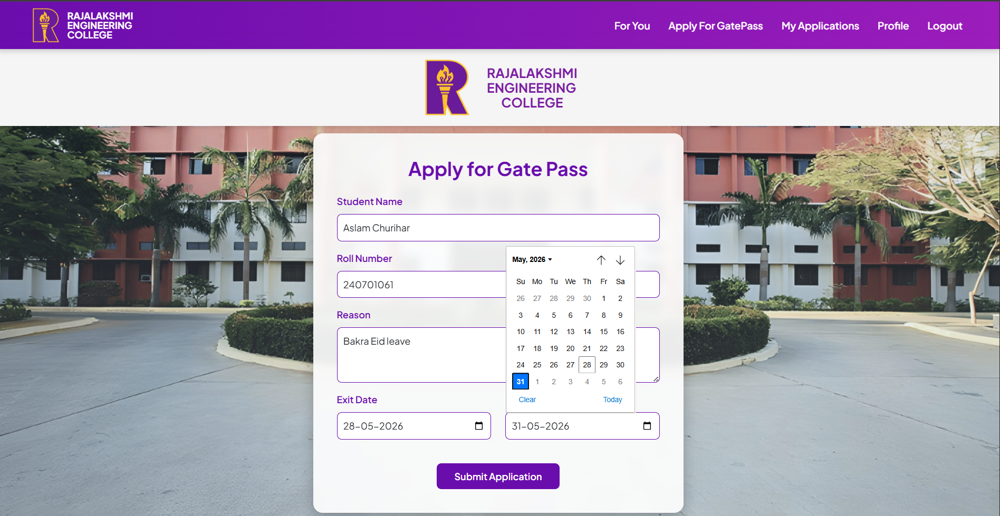
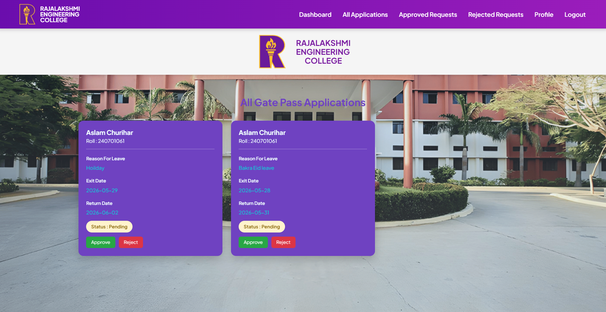

# Gate Pass Management System

A full-stack MERN-based Gate Pass Management System for hostel and college students to apply for gate passes online, with a warden/admin dashboard for approvals.

---

## 📌 Project Overview

Helps students request campus/hostel leave digitally. Wardens can approve or reject applications through a dashboard — reducing manual paperwork.

---

## 🌐 Live Demo

🚀 **Live Application:** [Gate Pass Management System]
<https://gate-pass-management-system-oewe.onrender.com>

---

## 🚀 Features

### 👨‍🎓 Student Features

- Registration & Login
- Secure Authentication
- Apply for Gate Pass
- View Submitted Applications
- Track Approval Status
- Profile Management

### 👨‍💼 Admin / Warden Features

- Admin Dashboard
- View All Applications
- Approve / Reject Gate Pass Requests
- Manage Student Requests

---

## 🛠️ Tech Stack

| Layer | Technologies |
|-------|-------------|
| Frontend | HTML, CSS, JavaScript, EJS, Bootstrap |
| Backend | Node.js, Express.js |
| Database | MongoDB, Mongoose |
| Auth & Validation | Passport.js, Express Session, Joi |

---

## ⚙️ Installation & Setup

### 1. Clone the repository

```bash
git clone https://github.com/Aslam-Siddiki/gate-pass-management-system.git
cd gatepass-management-system
```

### 2. Install dependencies

```bash
npm install
```

### 3. Set up environment variables

Create a `.env` file in the root directory:

```env
MONGO_URL=your_mongodb_connection_string
SESSION_SECRET=your_session_secret
NODE_ENV=production
```

### 4. Run the project

```bash
node app.js
```

or with live reload:

```bash
nodemon app.js
```

App runs at: `http://localhost:8080`

---

## ☁️ Deployment (Render.com)

1. Push your project to GitHub
2. Go to [render.com](https://render.com) and create a **New Web Service**
3. Connect your GitHub repository
4. Set the following:
   - **Build Command:** `npm install`
   - **Start Command:** `node app.js`
5. Add environment variables under **Environment**:
   - `MONGO_URL` → your MongoDB Atlas connection string
   - `SESSION_SECRET` → your secret key
   - `NODE_ENV` → `production`
6. Click **Deploy** — your live URL will be `https://your-app-name.onrender.com`

---

## 📸 Screenshots

> Screenshots are stored locally under `./screenshots/`. To display them on GitHub, upload them to the repo and use their raw GitHub URLs.

| Page | Preview |
|---|---|
| Home Page |  |
| Application Form |  |
| Admin Dashboard |  |

---

## 📈 Future Improvements

- [ ] Email Notifications
- [ ] QR Code Gate Pass
- [ ] Real-Time Status Updates
- [ ] PDF Gate Pass Download

---

## 🤝 Contributing

This project is for educational use. Pull requests are welcome for improvements or bug fixes. Please open an issue first to discuss what you'd like to change.

---

## 👨‍💻 Author

**Aslam Churihar**  
B.Tech CSE — Rajalakshmi Engineering College

---

## 📄 License

This project is developed for educational purposes.
